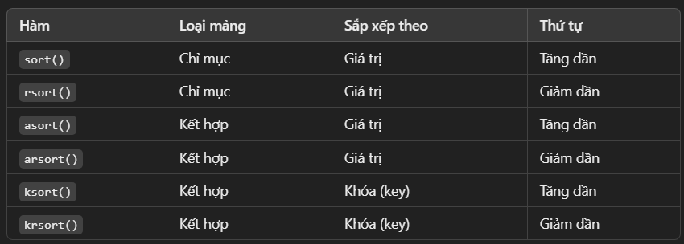

# Sắp xếp mảng trong PHP
- PHP cung cấp nhiều hàm sắp xếp theo thứ tự tăng dần, giảm dần.



### Indexed Array
- Sắp xếp tăng dần với `sort()`

- Sắp xếp giảm dần với `rsort()`

- Sắp xếp theo thứ tự:
    - Bảng chữ cái (Alphabetical Order) nếu là chuỗi.
        ```php
        $cars = array("Volvo", "BMW", "Toyota");
        sort($cars);
        print_r($cars);
        /*
        Kết quả:
        Array ( [0] => BMW [1] => Toyota [2] => Volvo )
        */

        rsort($cars);
        print_r($cars);
        /*
        Kết quả:
        Array ( [0] => Volvo [1] => Toyota [2] => BMW )
        */
        ```
    
    - Số tăng/giảm dần nếu là số.
        ```php
        $numbers = array(4, 6, 2, 22, 11);
        sort($numbers);
        print_r($numbers);
        /*
        Kết quả:
        Array ( [0] => 2 [1] => 4 [2] => 6 [3] => 11 [4] => 22 )
        */

        rsort($numbers);
        print_r($numbers);
        /*
        Kết quả:
        Array ( [0] => 22 [1] => 11 [2] => 6 [3] => 4 [4] => 2 )
        */
        ```

### Associative Array
- Sắp xếp tăng dần theo giá trị với `asort()`
    ```php
    $age = array("Peter"=>"35", "Ben"=>"37", "Joe"=>"43");
    asort($age);
    print_r($age);
    /*
    Kết quả:
    Array ( [Peter] => 35 [Ben] => 37 [Joe] => 43 )
    */
    ```

- Sắp xếp tăng dần theo khóa với `ksort()`
    ```php
    $age = array("Peter"=>"35", "Ben"=>"37", "Joe"=>"43");
    ksort($age);
    print_r($age);
    /*
    Kết quả:
    Array ( [Ben] => 37 [Joe] => 43 [Peter] => 35 )
    */
    ```

- Sắp xếp giảm dần theo giá trị với `arsort()`
    ```php
    $age = array("Peter"=>"35", "Ben"=>"37", "Joe"=>"43");
    arsort($age);
    print_r($age);
    /*
    Kết quả:
    Array ( [Joe] => 43 [Ben] => 37 [Peter] => 35 )
    */
    ```

- Sắp xếp giảm dần theo khóa với `krsort()`
    ```php
    $age = array("Peter"=>"35", "Ben"=>"37", "Joe"=>"43");
    krsort($age);
    print_r($age);
    /*
    Kết quả:
    Array ( [Peter] => 35 [Joe] => 43 [Ben] => 37 )
    */
    ```

- Lưu ý:
    - `sort()` và `rsort()` không giữ khóa, chỉ sắp xếp giá trị.

    - `asort()`, `arsort()`, `ksort()`, `krsort()` giữ nguyên khóa sau khi sắp xếp.