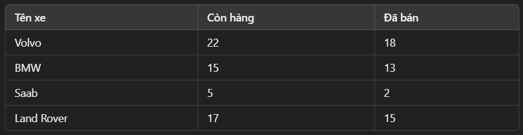

# Mảng Đa Chiều (Multidimensional Arrays) trong PHP
- Là mảng chứa một hoặc nhiều mảng bên trong.

- Giúp lưu trữ dữ liệu theo nhiều lớp, chẳng hạn như bảng hoặc cấu trúc phức tạp.

## Mảng Hai Chiều (Two-Dimensional Arrays)
- Có thể được xem như một bảng với hàng (row) và cột (column).

    

    ```php
    $cars = array (
        array("Volvo", 22, 18),
        array("BMW", 15, 13),
        array("Saab", 5, 2),
        array("Land Rover", 17, 15)
    );

    // $cars[0] = array("Volvo", 22, 18)
    // $cars[1] = array("BMW", 15, 13)
    // ...
    ```

- Truy Cập Phần Tử trong Mảng Hai Chiều
    - Sử dụng chỉ số hàng và cột (row, column)
        ```php
        echo $cars[0][0].": Còn hàng: ".$cars[0][1].", Đã bán: ".$cars[0][2].".<br>";
        echo $cars[1][0].": Còn hàng: ".$cars[1][1].", Đã bán: ".$cars[1][2].".<br>";
        echo $cars[2][0].": Còn hàng: ".$cars[2][1].", Đã bán: ".$cars[2][2].".<br>";
        echo $cars[3][0].": Còn hàng: ".$cars[3][1].", Đã bán: ".$cars[3][2].".<br>";
        ```

    - Output:
        ```
        Volvo: Còn hàng: 22, Đã bán: 18.
        BMW: Còn hàng: 15, Đã bán: 13.
        Saab: Còn hàng: 5, Đã bán: 2.
        Land Rover: Còn hàng: 17, Đã bán: 15.
        ```

- Lặp Qua Mảng Hai Chiều với Vòng Lặp
    - Sử dụng vòng lặp lồng nhau
        ```php
        for ($row = 0; $row < count($cars); $row++) {
            echo "<p><b>Dòng số $row</b></p>";
            echo "<ul>";
            for ($col = 0; $col < count($cars[$row]); $col++) {
                echo "<li>".$cars[$row][$col]."</li>";
            }
            echo "</ul>";
        }
        ```

## Mảng Ba Chiều (Three-Dimensional Arrays)
- Là mảng chứa mảng hai chiều

- Giúp lưu trữ nhiều bảng dữ liệu trong cùng một mảng.

    ```php
    $inventory = array(
        "cars" => array(
            array("Volvo", 22, 18),
            array("BMW", 15, 13)
        ),
        "bikes" => array(
            array("Yamaha", 10, 7),
            array("Honda", 8, 5)
        )
    );
    ```

- Truy xuất:
    ```php
    echo $inventory["cars"][0][0]; // Volvo
    echo $inventory["bikes"][1][1]; // 8
    ```