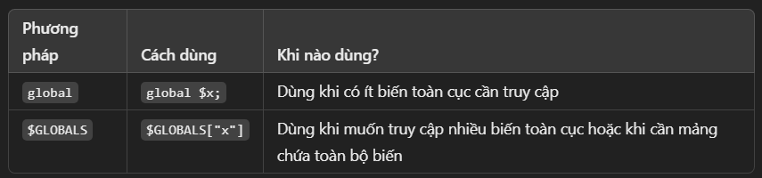

# $GLOBALS
- Biến $GLOBALS là một mảng liên kết chứa tất cả các biến toàn cục trong PHP.

- Có thể truy cập bất kỳ biến nào được khai báo bên ngoài một hàm từ bên trong hàm bằng $GLOBALS["ten_bien"]

### Biến toàn cục trong PHP
- Là những biến được khai báo bên ngoài tất cả các hàm

- Có thể được sử dụng ở mọi phạm vi nếu được khai báo rõ ràng.

```php
$x = 75;  // Biến toàn cục

function myFunction() {
    // Truy cập biến toàn cục bằng $GLOBALS
    echo $GLOBALS['x'];
}

myFunction(); // Output: 75
```

### Tạo biến Toàn cục bên trong hàm
- Có thể tạo một biến toàn cục mới từ bên trong một hàm bằng $GLOBALS.

```php
function myFunction() {
    $GLOBALS["y"] = 100; // Tạo biến toàn cục
}

myFunction();

echo $y;  // Output: 100
```

### Sự khác biệt khi không dùng $GLOBALS
- Nếu không dùng $GLOBALS hoặc global, không thể truy cập biến toàn cục từ bên trong hàm.

```php
$x = 75;

function myFunction() {
    echo $x; // LỖI: Biến $x không tồn tại trong phạm vi của hàm
}

myFunction();
```

### Cách Khác Để Truy Cập Biến Toàn Cục: global
- Có thể sử dụng từ khóa global để truy cập biến toàn cục.

```php
$x = 75;

function myFunction() {
    global $x;
    echo $x; // Output: 75
}

myFunction();
```

### So sánh global và $GLOBALS

