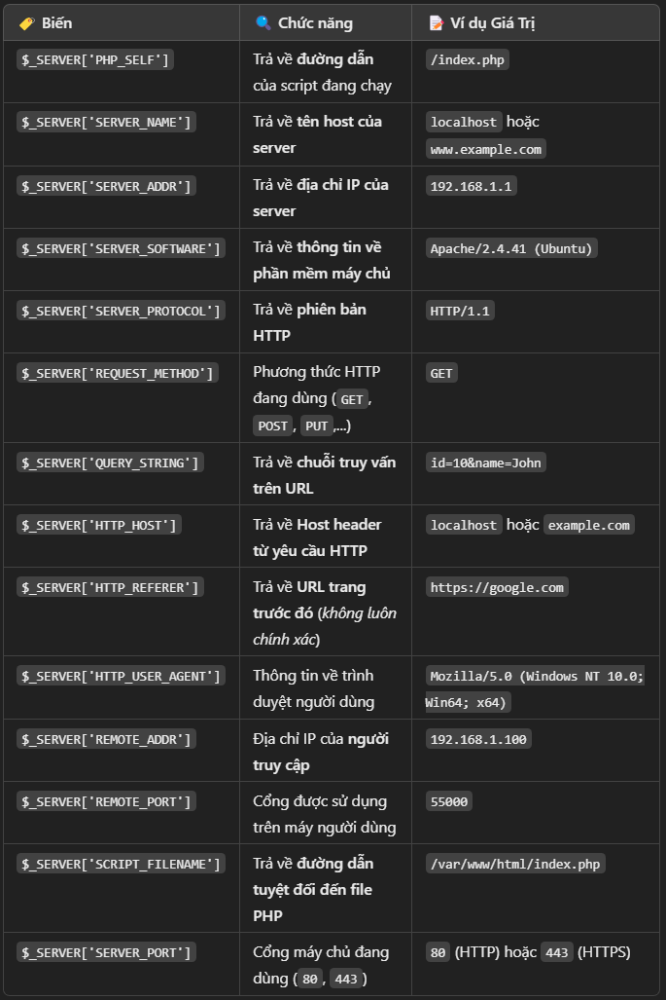

# $_SERVER
- $_SERVER là một biến siêu toàn cục (super global) trong PHP.

- Chứa thông tin về máy chủ (server) và yêu cầu HTTP.

- Mảng $_SERVER chứa thông tin về server, request, header và đường dẫn, vị trí của script đang chạy..

# Cách dùng
- Có thể sử dụng $_SERVER để lấy thông tin về môi trường máy chủ và yêu cầu hiện tại.
    ```php
    echo $_SERVER['PHP_SELF']; // Đường dẫn file đang chạy
    echo $_SERVER['SERVER_NAME']; // Tên server (localhost)
    echo $_SERVER['HTTP_HOST']; // Host (localhost)
    echo $_SERVER['REMOTE_ADDR']; // Địa chỉ IP client
    echo $_SERVER['REQUEST_METHOD']; // Phương thức GET hoặc POST
    echo $_SERVER['SCRIPT_NAME'];   // Trả về đường dẫn script
    echo $_SERVER['HTTP_USER_AGENT']; // Trả về thông tin trình duyệt (User-Agent)
    ```

- Kết quả thu đươc:
    ```
    /index.php
    localhost
    localhost
    Mozilla/5.0 (Windows NT 10.0; Win64; x64)
    /index.php
    ```

- Ứng dụng: Kiểm tra phương thức request
    ```php
    if ($_SERVER["REQUEST_METHOD"] == "POST") {
        echo "Dữ liệu được gửi bằng POST";
    }
    ```

# Các Thành Phần Quan Trọng Trong $_SERVER
- Một số phần tử quan trọng trong $_SERVER và công dụng của chúng:



# Ví dụ thực tế
## Hiển thị thông tin server

```php
echo "<h3>Server Information</h3>";
echo "Tên server: " . $_SERVER['SERVER_NAME'] . "<br>";
echo "IP server: " . $_SERVER['SERVER_ADDR'] . "<br>";
echo "Phần mềm máy chủ: " . $_SERVER['SERVER_SOFTWARE'] . "<br>";
echo "Giao thức: " . $_SERVER['SERVER_PROTOCOL'] . "<br>";
echo "Phương thức yêu cầu: " . $_SERVER['REQUEST_METHOD'] . "<br>";
```

```
Tên server: localhost
IP server: 127.0.0.1
Phần mềm máy chủ: Apache/2.4.41 (Ubuntu)
Giao thức: HTTP/1.1
Phương thức yêu cầu: GET
```

## Lấy địa chỉ IP người truy cập
- Ứng dụng thực tế:
    - Dùng để ghi log truy cập, giới hạn IP, chặn bot,...

```php
$user_ip = $_SERVER['REMOTE_ADDR'];
echo "Địa chỉ IP của bạn là: " . $user_ip;
```

## Kiểm tra người dùng đến từ đâu (HTTP_REFERER)
```php
if (isset($_SERVER['HTTP_REFERER'])) {
    echo "Bạn đã đến từ: " . $_SERVER['HTTP_REFERER'];
} else {
    echo "Không xác định nguồn gốc truy cập.";
}
```

- Lưu ý:
    - HTTP_REFERER không phải lúc nào cũng chính xác vì có thể bị ẩn bởi trình duyệt.

## Kiểm tra nếu truy cập bằng HTTPS
```php
if (!empty($_SERVER['HTTPS']) && $_SERVER['HTTPS'] !== 'off') {
    echo "Bạn đang truy cập bằng HTTPS";
} else {
    echo "Bạn đang truy cập bằng HTTP";
}
```

- Ứng dụng:
    - Tự động chuyển hướng HTTP → HTTPS để tăng bảo mật.